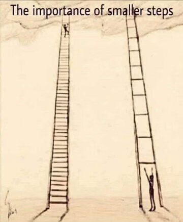

**Trello** https://trello.com/b/GGsPWT9w/to-code-or-not-to-code
**Github(for frontend):** https://github.com/MarsiaRochelin/portfolio-project-frontend
**Github(for backend):** https://github.com/MarsiaRochelin/backend
**Deployed frontend:** https://stately-capybara-6fc33a.netlify.app/
**Deployed backend:** https://portfolio-project-backend.onrender.com/projects

**User Stories**

**(MVP)**
As a User you see a landing page welcoming you which has a navbar with Index (of projects), About, and New Project buttons that when you hover over then you'll see a click pointer thar will redirect you to new pages.

As a user once you click onto the Index you will be redirected to a page showing you all the available projects. When a user hovers over the project name they should see a click pointer and once they click on it they'll be redirected to a new page.

As a user you will see information list out on the page about the project that will be helpful in determining wether or not you could be a good fit for collaborating on listed project(s) I am building.

They'll be a back button for navigating you back to the index, edit button to update projects, and a delete buttons to delete projects entirely.

<!-- This image was added to remind me to respect my app journey and celebrate my pace. When I conceptualized my app initially it had more functionality. I took my instructors advice and choose to strive for MVP for the duration of the sprint. Doing so and coding out every part from scratch made me digest my code better seeing the flow and processing code which I can I didn't fully digest at times in class.-->

**(Stretch features)**
As a user you should you should see a login/create a login prompt once you visit the site.

As a user you should you should see a landing page welcoming you to the app once logged in and/or user created a login and that has a prompt asking if you have any new projects you want to associate with your account.

    If a project is added by the user they'll be redirected to their user/account page were they'll see the project is added to their account.

    Users could visit the project board link in the navbar if they do not have projects to add to their account to see current listing of projects as well as a clickable link that will redirected users to a profile associated with the project owner so they can determine their interest in collaborating with them.

    Users could also able visit community link in the navbar to see the app list of current users, that will direct you to their individual pages were you can learn about the user(s).

As a user you will see suggestions of other users you could collaborate with based on keywords listed in yours and/or other users profile (ex: project description and technology utilized for a project).

As a User you will be able to edit information relating to you and your listed project by clicking on user on the navbar.
